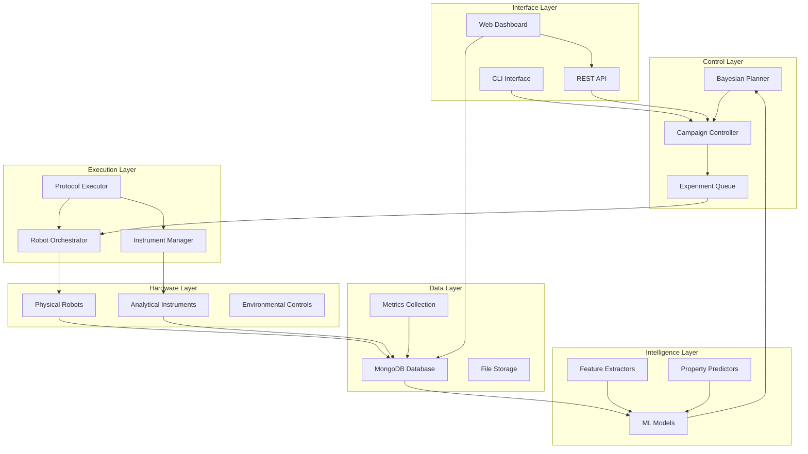
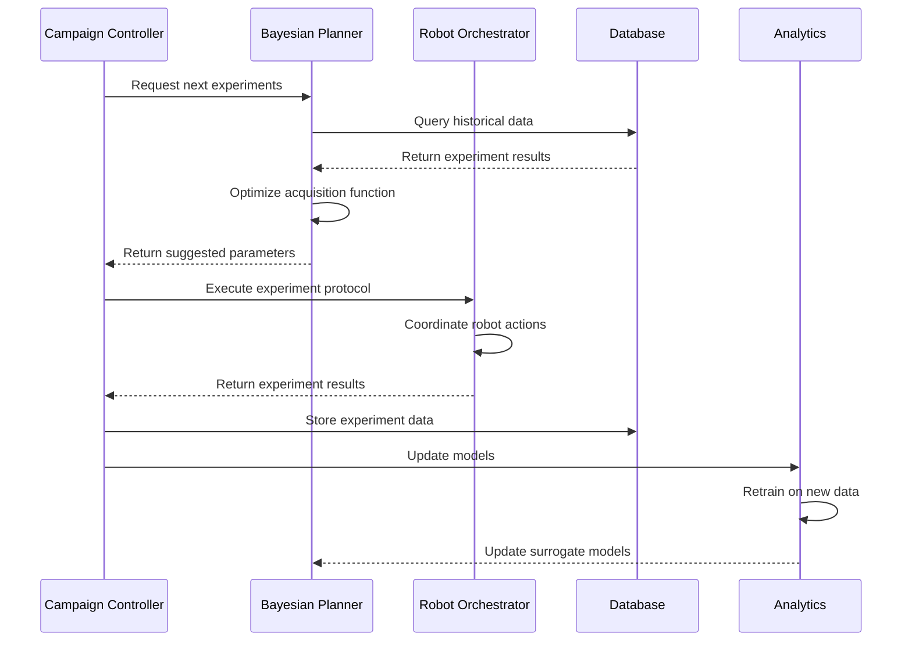

# Architecture Overview

This document describes the high-level architecture of the self-driving-materials-orchestrator system.

## System Architecture

### Component Overview

### Core Components

#### 1. Autonomous Laboratory Core (`src/materials_orchestrator/core.py`)
- **Purpose**: Central orchestration of autonomous experiments
- **Key Classes**: `AutonomousLab`, `MaterialsObjective`
- **Responsibilities**:
  - Campaign management and execution
  - Resource coordination and scheduling
  - Real-time decision making
  - Safety monitoring and emergency stops

#### 2. Bayesian Optimization (`src/materials_orchestrator/planners.py`)
- **Purpose**: Intelligent experiment planning using Bayesian optimization
- **Key Classes**: `BayesianPlanner`, `MaterialsOptimizer`
- **Responsibilities**:
  - Parameter space exploration
  - Acquisition function optimization
  - Multi-objective optimization
  - Convergence detection

#### 3. Robot Orchestration
- **Purpose**: Hardware abstraction and control
- **Key Components**: Robot drivers, protocol translation
- **Responsibilities**:
  - Hardware communication
  - Safety interlocks
  - Error handling and recovery
  - Real-time status monitoring

#### 4. Data Management
- **Purpose**: Experiment data storage and retrieval
- **Database**: MongoDB for document-based storage
- **Responsibilities**:
  - Experiment result storage
  - Provenance tracking
  - Data versioning
  - Query optimization

### Data Flow Architecture

### Security Architecture

#### 1. Access Control
- Role-based access control (RBAC)
- API key authentication for programmatic access
- Session management for web interface

#### 2. Data Protection
- Encryption at rest for sensitive data
- TLS for all network communications
- Audit logging for all operations

#### 3. Hardware Safety
- Emergency stop mechanisms
- Hardware interlocks
- Real-time monitoring
- Graceful degradation

### Scalability Architecture

#### 1. Horizontal Scaling
- Microservices architecture
- Container orchestration with Docker
- Load balancing for API endpoints

#### 2. Database Scaling
- MongoDB replica sets
- Read replicas for analytics workloads
- Sharding for large datasets

#### 3. Compute Scaling
- Distributed optimization algorithms
- Cloud-based ML model training
- Edge computing for real-time control

### Integration Points

#### 1. External Systems
- Laboratory Information Management Systems (LIMS)
- Material databases (Materials Project)
- Scientific instruments via standard protocols

#### 2. Cloud Services
- Model training on cloud platforms
- Backup and disaster recovery
- Remote monitoring and alerting

#### 3. APIs and Interfaces
- RESTful API for programmatic access
- GraphQL for complex queries
- WebSocket for real-time updates

## Design Principles

### 1. Modularity
- Loosely coupled components
- Clear interface definitions
- Pluggable architecture for new algorithms

### 2. Reliability
- Fault tolerance and graceful degradation
- Comprehensive error handling
- Automatic recovery mechanisms

### 3. Observability
- Comprehensive logging
- Metrics collection
- Distributed tracing
- Real-time monitoring

### 4. Security
- Defense in depth
- Principle of least privilege
- Secure by default configuration

### 5. Performance
- Efficient algorithms
- Caching strategies
- Asynchronous processing
- Resource optimization

## Technology Stack

### Core Technologies
- **Language**: Python 3.9+
- **Framework**: FastAPI for REST API
- **Database**: MongoDB for document storage
- **Message Queue**: Redis for task queuing
- **Containerization**: Docker with multi-stage builds

### Machine Learning
- **Optimization**: Bayesian optimization (scikit-optimize)
- **Models**: Gaussian Processes, Random Forests
- **Feature Engineering**: scikit-learn
- **Deep Learning**: PyTorch for neural network models

### Infrastructure
- **Orchestration**: Docker Compose for development
- **Monitoring**: Prometheus + Grafana
- **Logging**: Structured logging with JSON format
- **Documentation**: MkDocs with Material theme

### Hardware Integration
- **Robotics**: ROS2 for robot communication
- **Instruments**: SCPI, REST APIs, custom protocols
- **Networking**: Industrial Ethernet, TCP/IP

## Deployment Architecture

### Development Environment
- Local development with Docker Compose
- Hot reload for rapid development
- Isolated testing environments

### Production Environment
- Container orchestration (Kubernetes recommended)
- High availability database cluster
- Load balancing and service discovery
- Comprehensive monitoring and alerting

### Edge Deployment
- Lightweight containers for lab computers
- Local caching and offline capabilities
- Secure communication with central systems

## Quality Attributes

### Performance
- **Throughput**: 100+ experiments per day
- **Latency**: <100ms for API responses
- **Optimization**: Convergence in <50 experiments

### Reliability
- **Availability**: 99.9% uptime
- **Durability**: Zero data loss with proper backups
- **Recovery**: <15 minutes recovery time

### Security
- **Authentication**: Multi-factor authentication
- **Authorization**: Role-based access control
- **Compliance**: Laboratory safety standards

### Maintainability
- **Code Quality**: >90% test coverage
- **Documentation**: Comprehensive API docs
- **Monitoring**: Real-time health checks

## Future Architecture Considerations

### 1. Multi-Lab Coordination
- Federated learning across laboratories
- Shared knowledge bases
- Standardized protocols

### 2. AI/ML Enhancements
- Large language models for experiment design
- Computer vision for result analysis
- Reinforcement learning for control optimization

### 3. Cloud-Native Evolution
- Serverless functions for specific tasks
- Event-driven architecture
- Global data synchronization

This architecture supports the current requirements while providing flexibility for future enhancements and scaling needs.