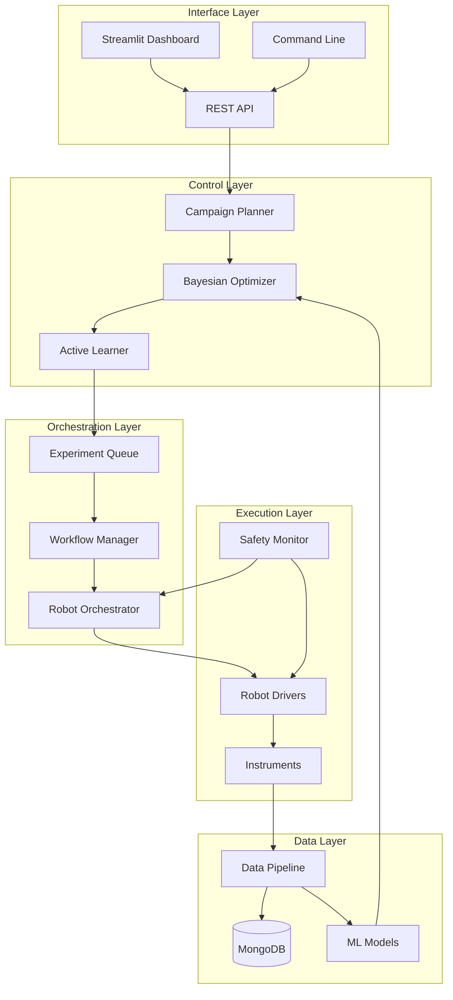
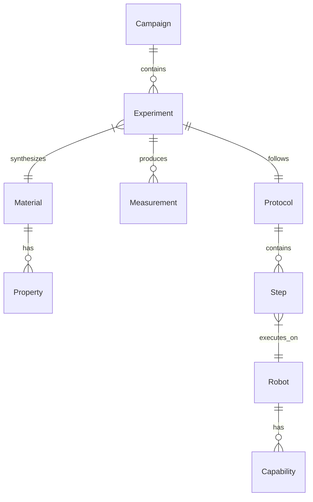

# System Architecture - Self-Driving Materials Orchestrator

## Overview

The Self-Driving Materials Orchestrator is a comprehensive autonomous laboratory system designed for accelerated materials discovery. The architecture follows a modular, event-driven design that enables autonomous experiment planning, execution, and analysis.

## System Design

### High-Level Architecture



### Component Architecture

#### 1. Control Layer

**Campaign Planner (`materials_orchestrator.planners`)**
- Manages high-level experimental campaigns
- Defines objectives and constraints
- Handles multi-objective optimization scenarios

**Bayesian Optimizer (`materials_orchestrator.optimization`)**
- Implements Gaussian Process-based optimization
- Acquisition function selection (EI, UCB, PI)
- Uncertainty quantification and exploitation/exploration balance

**Active Learner (`materials_orchestrator.active_learning`)**
- Selects most informative experiments
- Manages model uncertainty
- Implements diversity-based selection

#### 2. Orchestration Layer

**Robot Orchestrator (`materials_orchestrator.robots`)**
- Coordinates multiple robots and instruments
- Handles resource allocation and scheduling
- Manages parallel experiment execution

**Experiment Queue (`materials_orchestrator.queue`)**
- Priority-based experiment scheduling
- Resource availability tracking
- Failure handling and retry logic

**Workflow Manager (`materials_orchestrator.workflows`)**
- Defines experimental protocols
- Handles complex multi-step procedures
- Manages dependencies between experiments

#### 3. Execution Layer

**Robot Drivers (`materials_orchestrator.robots.drivers`)**
- Hardware abstraction layer
- Standardized robot control interface
- Support for Opentrons, Chemspeed, custom ROS2 robots

**Instruments (`materials_orchestrator.instruments`)**
- Characterization equipment control
- Data acquisition and preprocessing
- Calibration and quality control

**Safety Monitor (`materials_orchestrator.safety`)**
- Emergency stop mechanisms
- Environmental monitoring
- Automated safety protocols

#### 4. Data Layer

**MongoDB Database**
- Experiment parameters and results
- Material property database
- Campaign history and provenance

**Data Pipeline (`materials_orchestrator.pipeline`)**
- Real-time data processing
- Feature extraction and normalization
- Quality assessment and validation

**ML Models (`materials_orchestrator.models`)**
- Gaussian Process regressors
- Neural network property predictors
- Ensemble methods for uncertainty

#### 5. Interface Layer

**REST API (`materials_orchestrator.api`)**
- RESTful endpoints for all operations
- Authentication and authorization
- Rate limiting and monitoring

**Streamlit Dashboard**
- Real-time experiment monitoring
- Interactive parameter space exploration
- Campaign management interface

**Command Line Interface (`materials_orchestrator.cli`)**
- Automated campaign launching
- Batch experiment submission
- System administration tools

## Data Flow

### Experiment Lifecycle

1. **Planning Phase**
   ```
   Campaign Definition → Objective Setting → Parameter Space Definition
   ```

2. **Optimization Phase**  
   ```
   Historical Data → Surrogate Model → Acquisition Function → Next Experiments
   ```

3. **Execution Phase**
   ```
   Experiment Queue → Resource Allocation → Protocol Execution → Data Collection
   ```

4. **Analysis Phase**
   ```
   Raw Data → Processing Pipeline → Property Extraction → Model Update
   ```

5. **Decision Phase**
   ```
   Updated Model → Convergence Check → Next Iteration / Campaign Complete
   ```

### Data Persistence



## Technology Stack

### Core Framework
- **Python 3.9+**: Primary development language
- **FastAPI**: REST API framework
- **Streamlit**: Dashboard interface
- **ROS2**: Robot communication layer

### Data & ML
- **MongoDB**: Primary database
- **scikit-learn**: Machine learning algorithms
- **GPy**: Gaussian Process library
- **NumPy/SciPy**: Scientific computing
- **Pandas**: Data manipulation

### Infrastructure
- **Docker**: Containerization
- **Docker Compose**: Multi-service orchestration
- **Prometheus**: Metrics collection
- **Grafana**: Monitoring dashboards

### Hardware Integration
- **Opentrons API**: Liquid handling robots
- **PySerial**: Serial device communication
- **ROS2 Control**: Generic robot control

## Scalability Considerations

### Horizontal Scaling
- Multiple robot orchestrators can run in parallel
- Database sharding for large experiment datasets
- Load balancing for API endpoints
- Distributed optimization for multiple campaigns

### Performance Optimization
- Asynchronous experiment execution
- Caching for frequent database queries
- Model prediction batching
- Real-time data streaming

### Resource Management
- Robot availability tracking
- Reagent inventory management
- Instrument scheduling optimization
- Priority-based resource allocation

## Security Architecture

### Authentication & Authorization
- JWT-based API authentication
- Role-based access control (RBAC)
- Experiment-level permissions
- Audit logging for all operations

### Data Protection
- Encrypted data at rest (MongoDB encryption)
- TLS for data in transit
- Secure robot communication channels
- Backup and disaster recovery procedures

### Safety Systems
- Hardware emergency stops
- Software safety interlocks
- Environmental monitoring integration
- Automated shutdown procedures

## Deployment Architecture

### Development Environment
```yaml
services:
  - orchestrator: Local development server
  - database: MongoDB container
  - robots: Simulation mode
  - dashboard: Local Streamlit server
```

### Production Environment
```yaml
services:
  - orchestrator: Containerized application server
  - database: MongoDB replica set
  - robots: Physical hardware connections
  - dashboard: Load-balanced web interface
  - monitoring: Prometheus + Grafana stack
```

### Cloud Integration
- Container registry for deployment images
- Secrets management for credentials
- Monitoring and alerting integration
- Backup storage for experiment data

## Monitoring & Observability

### Key Metrics
- Experiment success rate
- Robot utilization percentage
- Discovery rate (materials/day)
- Campaign convergence time
- System availability uptime

### Logging Strategy
- Structured logging with correlation IDs
- Centralized log aggregation
- Real-time error alerting
- Performance metrics collection

### Health Checks
- Database connectivity monitoring
- Robot status verification
- Model performance tracking
- Resource availability checks

## Future Architecture Considerations

### Planned Enhancements
- Multi-lab federation
- Advanced active learning algorithms
- Real-time adaptive optimization
- Enhanced simulation capabilities
- Cloud-native deployment options

### Integration Roadmap
- Additional robot platform support
- Advanced characterization instruments
- External materials databases
- Machine learning workflow optimization
- Collaborative research features