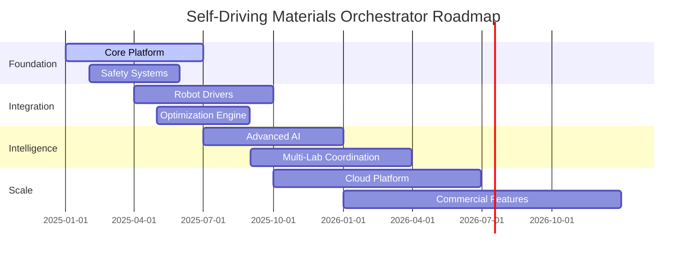

# Project Roadmap: Self-Driving Materials Orchestrator

## Vision Statement

Transform materials discovery from a manual, time-intensive process to an autonomous, intelligent system that accelerates breakthrough discoveries by 10x while reducing costs by 90%.

## Strategic Themes

### 🤖 **Autonomous Intelligence**
- Fully autonomous experiment planning and execution
- Self-improving optimization algorithms
- Intelligent failure recovery and adaptation

### 🔗 **Universal Integration**
- Seamless integration with any laboratory equipment
- Standard protocols for instrument communication
- Cloud and edge deployment flexibility

### 🌐 **Global Collaboration**
- Multi-laboratory coordination and knowledge sharing
- Federated learning across institutions
- Open science and reproducible research

### 🛡️ **Safety & Reliability**
- Bulletproof safety systems and protocols
- 99.9% uptime and zero data loss
- Compliance with international standards

## Roadmap Timeline

---

## 🚀 Version 1.0: Foundation (Q1-Q2 2025)

**Theme**: Establish core autonomous experimentation capabilities

### Major Features

#### 🏗️ Core Platform Architecture
- **Autonomous Lab Controller**: Central orchestration system
- **Experiment Queue Management**: Priority-based experiment scheduling
- **Real-time Monitoring**: Live experiment tracking and status
- **Data Management**: MongoDB-based experiment result storage

#### 🤖 Basic Robot Integration
- **Opentrons OT-2/OT-3**: Liquid handling automation
- **Generic SCPI Instruments**: Analytical instrument control
- **Safety Interlocks**: Emergency stop and error recovery
- **Protocol Translation**: High-level commands to robot actions

#### 🧠 Bayesian Optimization
- **Gaussian Process Models**: Surrogate model for property prediction
- **Acquisition Functions**: Expected improvement and upper confidence bound
- **Multi-objective Support**: Pareto optimization for competing objectives
- **Convergence Detection**: Automatic campaign stopping criteria

#### 🛡️ Safety & Monitoring
- **Emergency Stop Systems**: Hardware and software safety controls
- **Real-time Monitoring**: Live experiment and system health tracking
- **Error Recovery**: Automatic retry and graceful degradation
- **Audit Logging**: Comprehensive operation logging for compliance

### Success Metrics
- ✅ Demonstrate end-to-end autonomous optimization loop
- ✅ 5x faster convergence compared to grid search
- ✅ 99% experiment execution success rate
- ✅ Zero safety incidents during testing

### Key Deliverables
- [ ] Core platform v1.0 release
- [ ] Opentrons driver with full protocol support
- [ ] Bayesian optimization engine
- [ ] Safety system certification
- [ ] Basic web dashboard
- [ ] Developer documentation

---

## 🔧 Version 1.5: Enhanced Integration (Q3-Q4 2025)

**Theme**: Expand hardware compatibility and optimization capabilities

### Major Features

#### 🤖 Extended Robot Support
- **Chemspeed SWING/FLEX**: High-throughput synthesis platforms
- **Custom ROS2 Robots**: Integration with research robotics
- **Multi-Robot Coordination**: Parallel experiment execution
- **Advanced Protocols**: Complex multi-step synthesis workflows

#### 🧠 Advanced Optimization
- **Active Learning**: Uncertainty-based experiment selection
- **Transfer Learning**: Knowledge transfer between similar campaigns
- **Ensemble Models**: Multiple surrogate models for robustness
- **Constraint Handling**: Physical and chemical constraint enforcement

#### 📊 Enhanced Analytics
- **Real-time Analysis**: On-the-fly result processing and decision making
- **Pattern Recognition**: Automatic identification of promising regions
- **Experiment Design**: AI-assisted protocol generation
- **Failure Analysis**: Automatic root cause analysis

#### 🌐 Cloud Integration
- **Remote Monitoring**: Cloud-based dashboard and alerting
- **Model Training**: Distributed ML model training
- **Data Synchronization**: Multi-site data sharing
- **Backup & Recovery**: Automated backup and disaster recovery

### Success Metrics
- ✅ Support 5+ different robot platforms
- ✅ 10x acceleration compared to manual experimentation
- ✅ 95% success rate across diverse material systems
- ✅ 24/7 autonomous operation capability

### Key Deliverables
- [ ] Multi-robot orchestration system
- [ ] Advanced optimization algorithms
- [ ] Cloud deployment infrastructure
- [ ] Enhanced web interface with real-time updates
- [ ] API documentation and SDKs

---

## 🧠 Version 2.0: Artificial Intelligence (Q1-Q2 2026)

**Theme**: Integrate cutting-edge AI for intelligent experiment design

### Major Features

#### 🤖 AI-Driven Design
- **Large Language Models**: Natural language experiment design
- **Computer Vision**: Automated result interpretation from images
- **Generative Models**: Novel material structure generation
- **Causal Inference**: Understanding structure-property relationships

#### 🔬 Scientific Intelligence
- **Literature Integration**: Automatic incorporation of published research
- **Hypothesis Generation**: AI-driven research hypothesis formation
- **Experimental Novelty**: Detection and prioritization of novel experiments
- **Scientific Reasoning**: Explainable AI for experiment recommendations

#### 🌐 Federated Learning
- **Multi-Lab Networks**: Coordinated learning across institutions
- **Privacy-Preserving**: Secure knowledge sharing without data exposure
- **Global Optimization**: Worldwide collaboration on common objectives
- **Knowledge Graphs**: Structured representation of materials knowledge

#### 📈 Predictive Analytics
- **Property Prediction**: Advanced models for material property forecasting
- **Synthesis Prediction**: Success probability for proposed syntheses
- **Timeline Estimation**: Accurate campaign duration predictions
- **Resource Optimization**: Intelligent resource allocation and scheduling

### Success Metrics
- ✅ AI-designed experiments outperform human-designed by 50%
- ✅ 90% accurate property predictions before synthesis
- ✅ Novel material discovery rate increased by 20x
- ✅ Successful federated learning across 10+ laboratories

### Key Deliverables
- [ ] AI experiment design engine
- [ ] Federated learning infrastructure
- [ ] Advanced predictive models
- [ ] Scientific reasoning interface
- [ ] Integration with major materials databases

---

## 🌐 Version 2.5: Global Scale (Q3-Q4 2026)

**Theme**: Enable worldwide autonomous materials discovery network

### Major Features

#### 🌍 Global Network
- **Laboratory Federation**: Worldwide network of autonomous labs
- **Standardized Protocols**: Common interfaces and data formats
- **Distributed Computing**: Global compute resource sharing
- **Collaborative Campaigns**: Multi-institution research projects

#### 🏢 Enterprise Features
- **Multi-tenancy**: Secure isolation for different organizations
- **Role-based Access**: Advanced user management and permissions
- **Compliance Tools**: Regulatory compliance automation
- **Enterprise APIs**: Integration with enterprise systems

#### 📊 Advanced Analytics
- **Real-time Dashboards**: Comprehensive monitoring and analytics
- **Predictive Maintenance**: Equipment failure prediction and prevention
- **Resource Optimization**: Global resource utilization optimization
- **Scientific Impact**: Research output and citation tracking

#### 🔒 Security & Compliance
- **Zero-trust Architecture**: Advanced security model
- **Data Sovereignty**: Regional data storage and processing
- **Audit Compliance**: Automated compliance reporting
- **IP Protection**: Secure handling of proprietary research

### Success Metrics
- ✅ 100+ laboratories in global network
- ✅ Enterprise customers with >$1M ARR
- ✅ 99.99% uptime across global infrastructure
- ✅ Full compliance with international regulations

### Key Deliverables
- [ ] Global federation platform
- [ ] Enterprise security framework
- [ ] Advanced analytics suite
- [ ] Compliance automation tools
- [ ] Global marketplace for protocols

---

## 🚀 Version 3.0: Autonomous Discovery (2027+)

**Theme**: Fully autonomous scientific discovery with minimal human intervention

### Major Features

#### 🧬 Autonomous Science
- **Scientific Method Automation**: Full automation of scientific discovery process
- **Hypothesis-driven Research**: AI formulates and tests hypotheses
- **Literature Integration**: Automatic literature review and synthesis
- **Publication Automation**: AI-generated research papers and patents

#### 🔬 Advanced Materials
- **Quantum Materials**: Specialized tools for quantum material discovery
- **Biological Materials**: Bio-inspired and biomimetic material design
- **Extreme Conditions**: High-pressure, high-temperature synthesis
- **Nanoscale Precision**: Atomic-level material engineering

#### 🌟 Breakthrough Capabilities
- **Room-temperature Superconductors**: Targeted search for HTS materials
- **Carbon Capture Materials**: Optimized CO2 capture and conversion
- **Fusion Materials**: Materials for fusion reactor applications
- **Space Materials**: Materials for extreme space environments

#### 🌍 Societal Impact
- **Open Science**: Democratized access to advanced materials research
- **Education**: AI tutors for materials science education
- **Sustainability**: Focus on environmentally friendly materials
- **Global Health**: Materials for medical applications and drug delivery

### Long-term Vision
- ✅ Fully autonomous laboratories requiring minimal human oversight
- ✅ AI scientists making breakthrough discoveries independently
- ✅ 1000x acceleration in materials discovery timelines
- ✅ Revolutionary materials enabling new technologies

---

## 📊 Success Metrics Dashboard

### Technical Metrics
| Metric | Current | V1.0 Target | V2.0 Target | V3.0 Target |
|--------|---------|-------------|-------------|-------------|
| Experiment Throughput | 10/day | 100/day | 500/day | 1000/day |
| Success Rate | 60% | 95% | 98% | 99.5% |
| Time to Convergence | 200 exp | 50 exp | 20 exp | 10 exp |
| Cost per Experiment | $1000 | $100 | $50 | $25 |
| Lab Utilization | 30% | 90% | 95% | 98% |

### Business Metrics
| Metric | Current | V1.0 Target | V2.0 Target | V3.0 Target |
|--------|---------|-------------|-------------|-------------|
| Laboratory Deployments | 0 | 10 | 50 | 200 |
| Active Users | 0 | 100 | 1000 | 10000 |
| Revenue | $0 | $1M | $10M | $100M |
| Partnerships | 0 | 5 | 20 | 50 |
| Patents Filed | 0 | 10 | 50 | 200 |

### Scientific Impact
| Metric | Current | V1.0 Target | V2.0 Target | V3.0 Target |
|--------|---------|-------------|-------------|-------------|
| Publications | 0 | 5 | 25 | 100 |
| Citations | 0 | 100 | 1000 | 10000 |
| Novel Materials | 0 | 10 | 100 | 1000 |
| Breakthrough Discoveries | 0 | 1 | 5 | 20 |

---

## 🎯 Risk Mitigation Strategy

### Technical Risks
- **Integration Complexity**: Phased rollout with extensive testing
- **AI Safety**: Robust validation and human oversight mechanisms
- **Data Quality**: Automated data validation and cleaning
- **Scalability**: Cloud-native architecture with horizontal scaling

### Business Risks
- **Market Adoption**: Pilot programs and gradual deployment
- **Competition**: Open source model and community building
- **Funding**: Diversified funding sources and milestone-based releases
- **Regulatory**: Early engagement with regulatory bodies

### Operational Risks
- **Talent Acquisition**: Competitive compensation and remote work options
- **Knowledge Management**: Comprehensive documentation and training
- **Security**: Security-first design and regular audits
- **Reliability**: Redundant systems and disaster recovery plans

---

## 🤝 Community and Ecosystem

### Open Source Strategy
- **Core Platform**: Open source foundation with commercial extensions
- **Plugin Architecture**: Extensible system for community contributions
- **Documentation**: Comprehensive guides and tutorials
- **Support**: Community forums and developer resources

### Partnership Ecosystem
- **Hardware Vendors**: Integration partnerships with robot manufacturers
- **Software Companies**: API partnerships with scientific software
- **Academic Institutions**: Research collaborations and pilot programs
- **Industry**: Commercial deployments and case studies

### Developer Community
- **SDK Development**: Tools for extending the platform
- **Plugin Marketplace**: Community-contributed extensions
- **Hackathons**: Regular events to drive innovation
- **Certification**: Training and certification programs

---

## 📅 Milestone Schedule

### 2025 Milestones
- **Q1**: Core platform alpha release
- **Q2**: First autonomous optimization demonstration
- **Q3**: Multi-robot integration
- **Q4**: Production deployment at pilot sites

### 2026 Milestones
- **Q1**: AI-driven experiment design
- **Q2**: Federated learning network
- **Q3**: Enterprise platform launch
- **Q4**: Global network of 50+ laboratories

### 2027+ Milestones
- **2027**: Fully autonomous scientific discovery
- **2028**: Breakthrough material discoveries
- **2029**: Global impact on materials science
- **2030**: Revolutionary technologies enabled

---

*This roadmap is a living document that will be updated quarterly based on progress, feedback, and changing requirements. Community input and stakeholder feedback are essential for guiding the project's evolution.*