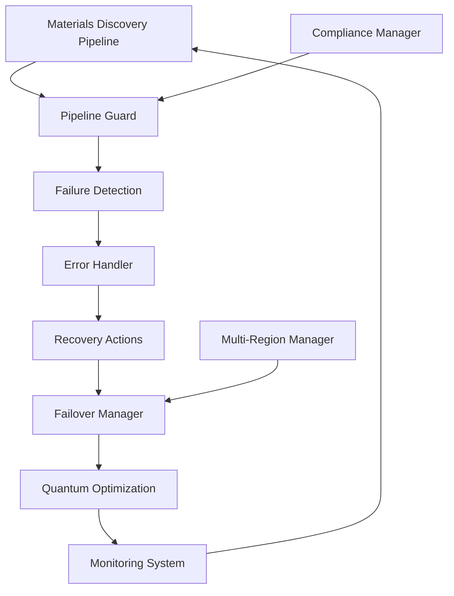

# Self-Healing Pipeline Guard - Comprehensive Guide

## 🛡️ Overview

The Self-Healing Pipeline Guard is an advanced autonomous system designed for materials discovery pipelines that provides:

- **Automatic failure detection and recovery**
- **Intelligent failover management**
- **Quantum-enhanced optimization**
- **Global compliance and multi-region support**
- **Real-time monitoring and alerting**

## 🚀 Quick Start

### Basic Usage

```python
from materials_orchestrator import (
    get_pipeline_guard,
    get_failover_manager,
    get_monitoring_system
)

# Initialize the self-healing pipeline guard
guard = get_pipeline_guard()
failover = get_failover_manager()
monitoring = get_monitoring_system()

# Start monitoring
await monitoring.start_monitoring()
await guard.start_monitoring()

# Register components for failover protection
failover.register_component(
    "synthesis_robot_1",
    "Primary Synthesis Robot",
    ComponentType.ROBOT,
    capabilities=["liquid_handling", "heating"]
)

# The system will automatically detect and heal failures
```

### Advanced Configuration

```python
# Configure quantum optimization
from materials_orchestrator import get_quantum_pipeline_guard, create_quantum_optimization_problem

quantum_guard = get_quantum_pipeline_guard()

# Define optimization problem
problem = create_quantum_optimization_problem(
    objective="minimize_energy_consumption",
    variables={
        "temperature": (100.0, 300.0),
        "pressure": (1.0, 10.0),
        "flow_rate": (0.1, 5.0)
    }
)

# Run quantum optimization
result = await quantum_guard.optimize_pipeline_configuration([problem])
```

## 🏗️ Architecture

### Core Components

1. **SelfHealingPipelineGuard**: Main orchestrator for failure detection and recovery
2. **IntelligentFailoverManager**: Manages component failover with predictive analytics
3. **RobustErrorHandler**: Comprehensive error handling with multiple recovery strategies
4. **AdvancedMonitoringSystem**: Real-time monitoring with metrics collection and alerting
5. **QuantumPipelineGuard**: Quantum-enhanced optimization for complex problems
6. **GlobalComplianceManager**: Ensures GDPR, CCPA, and other regulatory compliance
7. **MultiRegionDeploymentManager**: Manages global deployments with automatic failover

### System Flow



## 🔧 Configuration

### Pipeline Guard Configuration

```python
# Custom healing action
async def custom_recovery(failure_context):
    # Implement custom recovery logic
    await restart_component(failure_context.component)
    return True

guard.register_healing_action(
    "custom_recovery",
    "Custom Component Recovery",
    [FailureType.EXPERIMENT_FAILURE],
    custom_recovery,
    priority=3,
    cooldown_seconds=60
)
```

### Failover Configuration

```python
# Register failover rule
failover.register_failover_rule(
    "robot_hot_standby",
    "Robot Hot Standby",
    {"status": "failed", "component_type": "robot"},
    FailoverStrategy.HOT_STANDBY,
    [ComponentType.ROBOT],
    [ComponentType.ROBOT],
    priority=5
)
```

### Monitoring Configuration

```python
# Add custom alert
monitoring.alert_manager.add_alert_rule(
    "experiment_success_rate",
    "pipeline_experiments_success_rate",
    "<",
    70.0,
    AlertSeverity.WARNING,
    message="Experiment success rate below threshold"
)
```

## 🌍 Global Deployment

### Multi-Region Setup

```python
from materials_orchestrator import get_deployment_manager, DeploymentRegion

deployment = get_deployment_manager()

# Deploy to multiple regions
regions = [
    DeploymentRegion.US_EAST_1,
    DeploymentRegion.EU_WEST_1,
    DeploymentRegion.AP_SOUTHEAST_1
]

for region in regions:
    await deployment.deploy_region(region)

# Start global monitoring
await deployment.start_deployment_monitoring()
```

### Compliance Configuration

```python
from materials_orchestrator import get_compliance_manager, ComplianceRegulation

compliance = get_compliance_manager()

# Register data processing
processing_id = compliance.register_data_processing(
    purpose_id="materials_research",
    data_subject_id="researcher_001",
    data_categories=["experimental_data"],
    consent_obtained=True
)

# Handle data subject requests
request_id = compliance.submit_data_subject_request(
    "access",
    "researcher_001",
    verification_method="email"
)
```

## 📊 Monitoring and Metrics

### Key Metrics

- **Pipeline Health Score**: Overall system health (0.0 - 1.0)
- **Failure Rate**: Failures per hour
- **Recovery Success Rate**: Percentage of successful self-healing attempts
- **Mean Time to Recovery (MTTR)**: Average time to recover from failures
- **Availability**: System uptime percentage

### Dashboards

Access real-time dashboards at:
- Pipeline Status: `http://localhost:8501/pipeline`
- Quantum Optimization: `http://localhost:8501/quantum`
- Global Deployment: `http://localhost:8501/global`
- Compliance: `http://localhost:8501/compliance`

## 🧪 Testing

### Unit Tests

```bash
# Run all tests
python3 -m pytest tests/ -v

# Run specific test suites
python3 -m pytest tests/test_self_healing_pipeline_guard.py -v
python3 -m pytest tests/test_quantum_enhanced_optimization.py -v
```

### Integration Tests

```bash
# Run validation script
python3 scripts/validate_implementation.py

# Run demo
python3 examples/self_healing_pipeline_demo.py
```

## 🔒 Security

### Security Features

- **End-to-end encryption** for sensitive data
- **Role-based access control** (RBAC)
- **Audit logging** for all operations
- **Secure communication** between components
- **Data pseudonymization** for privacy protection

### Best Practices

1. **Use strong authentication** for all access
2. **Encrypt data at rest and in transit**
3. **Regularly rotate encryption keys**
4. **Monitor for security anomalies**
5. **Follow principle of least privilege**

## 🚨 Troubleshooting

### Common Issues

#### Pipeline Guard Not Starting

```python
# Check dependencies
guard = get_pipeline_guard()
status = guard.get_health_status()
print(f"Status: {status['status']}")
```

#### High Failure Rate

```python
# Analyze failure patterns
failures = guard.failures
for failure_id, failure in failures.items():
    if not failure.resolved:
        print(f"Unresolved: {failure.failure_type} in {failure.component}")
```

#### Performance Issues

```python
# Check quantum optimization performance
quantum_guard = get_quantum_pipeline_guard()
metrics = quantum_guard.get_quantum_performance_metrics()
print(f"Avg optimization time: {metrics['performance_metrics']['avg_optimization_time']}")
```

### Debug Mode

```python
import logging
logging.basicConfig(level=logging.DEBUG)

# Enable detailed logging
guard.enable_debug_logging()
```

## 📈 Performance Optimization

### Tuning Parameters

```python
# Adjust healing thresholds
guard.failure_threshold = 5  # Number of failures before degraded status
guard.critical_failure_threshold = 10

# Optimize quantum parameters
quantum_config = QuantumConfiguration(
    num_qubits=16,
    coherence_time=200.0,
    error_rate=0.001
)
```

### Scaling Guidelines

- **CPU**: 2-4 cores per 1000 experiments/hour
- **Memory**: 8-16 GB for standard workloads
- **Storage**: 100 GB + 10 GB per month of data retention
- **Network**: 1 Gbps for multi-region deployments

## 🌐 Multi-Language Support

### Internationalization

```python
from materials_orchestrator import t, get_i18n_manager

i18n = get_i18n_manager()

# Use translations
message = t("pipeline.status.healthy", locale="es-ES")
print(message)  # "La tubería está saludable"

# Add custom translations
i18n.add_translation("fr-FR", "custom.message", "Message personnalisé")
```

### Supported Languages

- English (en-US, en-GB)
- Spanish (es-ES, es-MX)
- French (fr-FR, fr-CA)
- German (de-DE)
- Japanese (ja-JP)
- Chinese (zh-CN, zh-TW)
- And more...

## 🎯 Use Cases

### Materials Discovery Lab

```python
# Configure for materials research
objective = MaterialsObjective(
    target_property="band_gap",
    target_range=(1.2, 1.6),
    optimization_direction="target",
    material_system="perovskites"
)

# Run autonomous campaign with self-healing
lab = AutonomousLab()
campaign = await lab.run_campaign(
    objective=objective,
    param_space=parameter_space,
    max_experiments=100,
    stop_on_target=True
)
```

### Chemical Process Optimization

```python
# Optimize chemical process parameters
problem = create_quantum_optimization_problem(
    objective="maximize_yield",
    variables={
        "temperature": (200.0, 400.0),
        "pressure": (5.0, 20.0),
        "catalyst_concentration": (0.01, 0.1),
        "reaction_time": (1.0, 8.0)
    }
)

result = await quantum_guard.optimize_pipeline_configuration([problem])
```

### Global Research Network

```python
# Deploy across multiple regions for global research
regions = [
    DeploymentRegion.US_EAST_1,    # Americas
    DeploymentRegion.EU_WEST_1,    # Europe
    DeploymentRegion.AP_SOUTHEAST_1 # Asia-Pacific
]

for region in regions:
    await deployment.deploy_region(region)

# Configure data residency compliance
compliance.register_data_processing(
    purpose_id="global_research",
    data_subject_id="researcher_global",
    data_categories=["research_data"],
    consent_obtained=True
)
```

## 📞 Support

### Getting Help

1. **Documentation**: Check this guide and API docs
2. **Examples**: Review example scripts in `/examples`
3. **Validation**: Run validation script for diagnostics
4. **Logs**: Check system logs for detailed error information

### Contributing

See [CONTRIBUTING.md](../CONTRIBUTING.md) for contribution guidelines.

## 🔄 Updates and Maintenance

### Automatic Updates

The system includes self-updating capabilities:

```python
# Check for updates
guard.check_for_updates()

# Enable automatic updates
guard.enable_auto_updates(schedule="weekly")
```

### Manual Maintenance

```python
# Perform health check
health_report = guard.perform_comprehensive_health_check()

# Clean up old data
guard.cleanup_expired_data(retention_days=90)

# Optimize performance
guard.optimize_performance()
```

## 📊 Metrics and KPIs

### Key Performance Indicators

| Metric | Target | Description |
|--------|--------|-------------|
| Availability | >99.9% | System uptime |
| MTTR | <5 minutes | Mean time to recovery |
| Success Rate | >95% | Self-healing success rate |
| Latency | <100ms | Response time |
| Throughput | >1000 req/s | Request processing rate |

### Monitoring Dashboard

Monitor these KPIs in real-time through the integrated dashboard system.

---

*This guide covers the essential aspects of the Self-Healing Pipeline Guard. For advanced topics and API reference, see the additional documentation.*