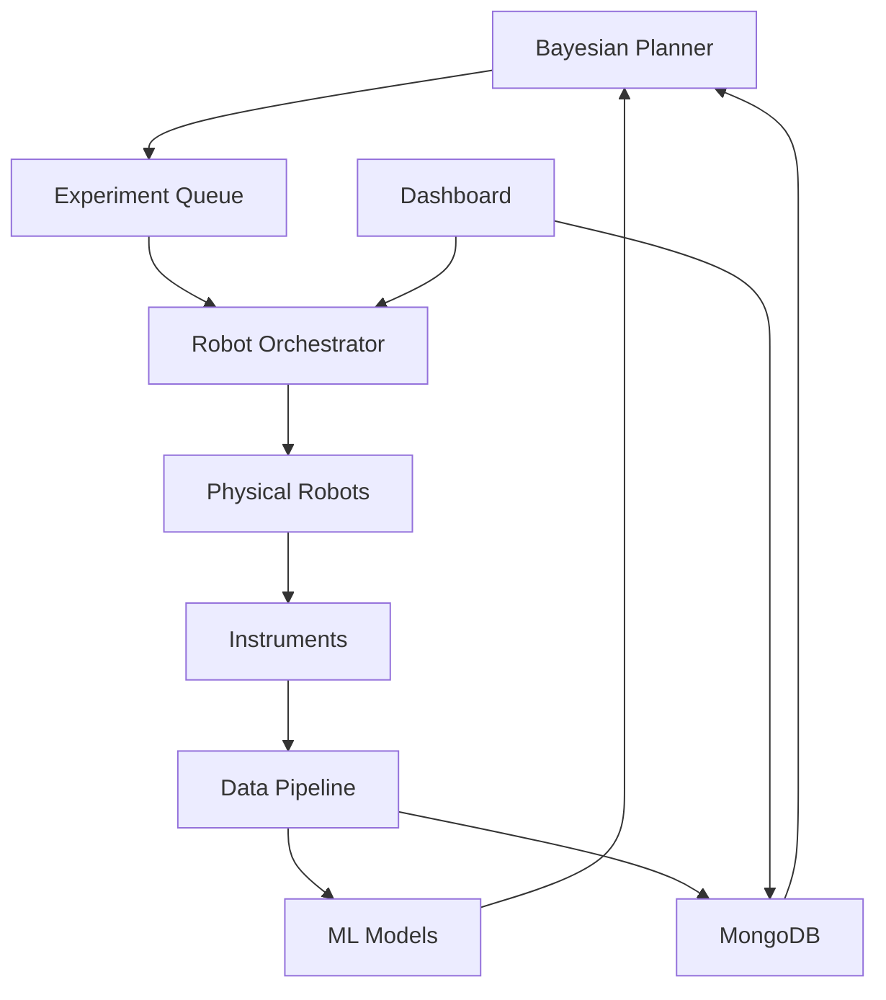

# Self-Driving Materials Orchestrator

Welcome to the documentation for the **Self-Driving Materials Orchestrator** - an end-to-end agentic pipeline that runs autonomous materials-discovery experiments on lab robots or virtual simulators.

## Overview

The Self-Driving Materials Orchestrator implements a complete autonomous laboratory system for accelerated materials discovery. Based on NC State's July 2025 "fast-forward" technique showing 10× faster data collection, this platform orchestrates experiments, analyzes results, and intelligently plans next steps without human intervention.

## Key Features

- **🧠 Bayesian Experiment Planner**: Intelligent selection of next experiments based on uncertainty
- **🤖 Robotic Control API**: Unified interface for lab automation (Opentrons, Chemspeed, custom)
- **⚡ Real-Time Analysis**: On-the-fly data processing and decision making
- **💾 MongoDB Result Vault**: Comprehensive experiment tracking and provenance
- **📊 Streamlit Dashboard**: Live monitoring of discoveries and material properties

## Quick Links

- [Installation Guide](quickstart/installation.md) - Get started in minutes
- [First Campaign](quickstart/first-campaign.md) - Run your first autonomous campaign
- [API Reference](api/core.md) - Complete API documentation
- [Contributing](CONTRIBUTING.md) - Help improve the platform

## Applications

| Material Class | Discovery Rate | Example Successes |
|----------------|----------------|-------------------|
| Photovoltaics | 15× faster | Perovskite with 28% efficiency |
| Catalysts | 12× faster | CO₂ reduction catalyst |
| Battery Materials | 8× faster | Solid-state electrolyte |
| Quantum Materials | 10× faster | Room-temp superconductor candidate |

## Architecture

## Getting Started

1. **[Install](quickstart/installation.md)** the orchestrator
2. **[Configure](quickstart/robot-setup.md)** your robots
3. **[Run](quickstart/first-campaign.md)** your first campaign
4. **[Monitor](guide/dashboard.md)** progress in real-time

## Community

- 🐛 [Report bugs](https://github.com/terragonlabs/self-driving-materials-orchestrator/issues)
- 💡 [Request features](https://github.com/terragonlabs/self-driving-materials-orchestrator/discussions)
- 🤝 [Contributing guidelines](CONTRIBUTING.md)
- 📧 [Contact us](mailto:daniel@terragonlabs.com)

## License

This project is licensed under the MIT License - see the [LICENSE](https://github.com/terragonlabs/self-driving-materials-orchestrator/blob/main/LICENSE) file for details.