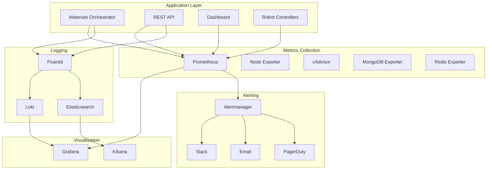

# Monitoring and Observability

## Overview

The Materials Orchestrator implements comprehensive monitoring and observability practices to ensure system reliability, performance, and operational excellence. Our monitoring stack provides:

- **Metrics Collection**: Prometheus-based metrics for all system components
- **Logging**: Structured logging with centralized aggregation
- **Tracing**: Distributed tracing for request flow analysis
- **Alerting**: Multi-channel alerting with intelligent escalation
- **Dashboards**: Rich visualization with Grafana
- **Health Checks**: Automated health monitoring for all services

## Architecture



## Metrics

### Application Metrics

The Materials Orchestrator exposes comprehensive metrics at `/metrics`:

#### Core Business Metrics
```python
# Campaign metrics
campaigns_active_total
campaigns_completed_total
campaigns_failed_total
campaign_duration_seconds

# Experiment metrics  
experiments_total
experiments_successful_total
experiments_failed_total
experiment_duration_seconds
experiment_queue_size

# Optimization metrics
optimization_iterations_total
optimization_convergence_time_seconds
optimization_suggestions_total
model_prediction_accuracy

# Discovery metrics
materials_discovered_total
target_materials_found_total
discovery_rate_per_hour
```

#### System Metrics
```python
# API performance
http_requests_total
http_request_duration_seconds
http_request_size_bytes
http_response_size_bytes

# Database metrics
database_queries_total
database_query_duration_seconds
database_connections_active
database_operations_total

# Robot metrics
robot_commands_total
robot_command_duration_seconds
robot_errors_total
robot_uptime_seconds
```

#### Resource Metrics
```python
# Memory and CPU
process_resident_memory_bytes
process_cpu_seconds_total
python_gc_objects_collected_total
python_info

# Custom resource metrics
experiment_memory_usage_bytes
optimization_cpu_usage_percent
data_storage_bytes
cache_hit_ratio
```

### Infrastructure Metrics

#### MongoDB Metrics (via mongodb_exporter)
- Connection counts and status
- Query performance and slow queries
- Replication lag and status
- Storage usage and fragmentation
- Index usage statistics

#### Redis Metrics (via redis_exporter)
- Memory usage and fragmentation
- Command statistics
- Key expiration and eviction
- Client connections
- Replication status

#### System Metrics (via node_exporter)
- CPU usage and load average
- Memory usage and swap
- Disk I/O and filesystem usage
- Network interface statistics
- System uptime and boot time

### Custom Robot Metrics

For integrated laboratory robots:

```python
# Opentrons metrics
opentrons_pipette_accuracy
opentrons_deck_temperature
opentrons_command_queue_size
opentrons_tip_usage_count

# Chemspeed metrics
chemspeed_reactor_temperature
chemspeed_stirrer_speed_rpm
chemspeed_valve_operations_total
chemspeed_synthesis_success_rate
```

## Logging

### Log Levels and Categories

#### Application Logs
```python
import logging
import structlog

# Configure structured logging
logger = structlog.get_logger("materials_orchestrator")

# Business events
logger.info("campaign_started", 
           campaign_id="camp_001", 
           objective="band_gap_optimization",
           target_range=[1.4, 1.6])

logger.info("experiment_completed",
           experiment_id="exp_12345",
           duration=45.2,
           success=True,
           properties={"band_gap": 1.52})

# System events
logger.warning("robot_connection_retry",
              robot_id="opentrons_1",
              attempt=3,
              error="Connection timeout")

logger.error("database_query_failed",
            query_type="aggregation",
            collection="experiments",
            error="Operation timeout")
```

#### Security Audit Logs
```python
# Authentication events
audit_logger.info("user_login",
                 user_id="researcher_1",
                 ip_address="192.168.1.100",
                 success=True)

# Data access events
audit_logger.info("data_export",
                 user_id="researcher_1", 
                 dataset="campaign_results",
                 record_count=1250)

# Configuration changes
audit_logger.warning("config_changed",
                    user_id="admin",
                    component="robot_settings",
                    changes={"temperature_limit": 300})
```

### Log Aggregation

#### Centralized Logging with Fluentd
```yaml
# fluent.conf
<source>
  @type forward
  port 24224
  bind 0.0.0.0
</source>

<filter materials.**>
  @type parser
  key_name message
  <parse>
    @type json
  </parse>
</filter>

<match materials.**>
  @type elasticsearch
  host elasticsearch
  port 9200
  index_name materials-logs
  type_name _doc
</match>
```

#### Log Retention Policies
- **Debug logs**: 7 days
- **Info logs**: 30 days  
- **Warning logs**: 90 days
- **Error logs**: 1 year
- **Audit logs**: 7 years (compliance requirement)

## Health Checks

### Application Health Endpoints

#### Basic Health Check
```bash
curl http://localhost:8000/health
```

Response:
```json
{
  "status": "healthy",
  "timestamp": "2025-08-01T10:30:00Z",
  "version": "1.0.0",
  "uptime": 86400,
  "checks": {
    "database": "healthy",
    "robots": "degraded", 
    "optimization": "healthy"
  }
}
```

#### Detailed Component Health
```bash
curl http://localhost:8000/health/detailed
```

Response:
```json
{
  "status": "healthy",
  "components": {
    "database": {
      "status": "healthy",
      "response_time": 15,
      "connections": 8,
      "last_query": "2025-08-01T10:29:45Z"
    },
    "robots": {
      "status": "degraded",
      "connected": 2,
      "total": 3,
      "failures": ["opentrons_2: connection timeout"],
      "last_command": "2025-08-01T10:25:30Z"
    },
    "optimization": {
      "status": "healthy",
      "models_loaded": 3,
      "last_prediction": "2025-08-01T10:28:12Z",
      "prediction_accuracy": 0.87
    }
  }
}
```

### Business Logic Health Checks

#### Campaign Health
```python
@app.get("/health/campaigns")
async def campaign_health():
    active_campaigns = await db.campaigns.count_documents({"status": "active"})
    stalled_campaigns = await db.campaigns.count_documents({
        "status": "active",
        "last_activity": {"$lt": datetime.utcnow() - timedelta(hours=6)}
    })
    
    return {
        "active_campaigns": active_campaigns,
        "stalled_campaigns": stalled_campaigns,
        "status": "healthy" if stalled_campaigns == 0 else "degraded"
    }
```

#### Experiment Queue Health
```python
@app.get("/health/queue")
async def queue_health():
    queue_size = await experiment_queue.size()
    processing = await experiment_queue.is_processing()
    avg_wait_time = await experiment_queue.average_wait_time()
    
    return {
        "queue_size": queue_size,
        "processing": processing,
        "average_wait_time": avg_wait_time,
        "status": "healthy" if processing and queue_size < 100 else "degraded"
    }
```

## Alerting

### Alert Rules (Prometheus)

#### Critical System Alerts
```yaml
# prometheus/alert_rules.yml
groups:
- name: critical_alerts
  rules:
  - alert: ServiceDown
    expr: up == 0
    for: 30s
    labels:
      severity: critical
    annotations:
      summary: "Service {{ $labels.instance }} is down"
      description: "{{ $labels.instance }} has been down for more than 30 seconds"

  - alert: HighMemoryUsage
    expr: (process_resident_memory_bytes / 1024 / 1024 / 1024) > 4
    for: 5m
    labels:
      severity: critical
    annotations:
      summary: "High memory usage on {{ $labels.instance }}"
      description: "Memory usage is {{ $value }}GB, above 4GB threshold"

  - alert: DatabaseConnectionFailure
    expr: mongodb_up == 0
    for: 1m
    labels:
      severity: critical
    annotations:
      summary: "Database connection failed"
      description: "Cannot connect to MongoDB database"
```

#### Business Logic Alerts
```yaml
- name: business_alerts
  rules:
  - alert: ExperimentFailureRate
    expr: (rate(experiments_failed_total[5m]) / rate(experiments_total[5m])) > 0.2
    for: 10m
    labels:
      severity: warning
    annotations:
      summary: "High experiment failure rate"
      description: "Experiment failure rate is {{ $value | humanizePercentage }}"

  - alert: OptimizationStalled
    expr: time() - optimization_last_update_timestamp > 3600
    for: 0s
    labels:
      severity: warning
    annotations:
      summary: "Optimization engine stalled"
      description: "No optimization updates for over 1 hour"

  - alert: RobotOffline
    expr: robot_uptime_seconds == 0
    for: 2m
    labels:
      severity: warning
    annotations:
      summary: "Robot {{ $labels.robot_id }} offline"
      description: "Robot has been offline for more than 2 minutes"
```

### Alert Channels

#### Slack Integration
```yaml
# alertmanager.yml
route:
  group_by: ['alertname']
  group_wait: 10s
  group_interval: 10s
  repeat_interval: 1h
  receiver: 'web.hook'

receivers:
- name: 'web.hook'
  slack_configs:
  - api_url: 'https://hooks.slack.com/services/...'
    channel: '#materials-alerts'
    title: 'Materials Orchestrator Alert'
    text: '{{ range .Alerts }}{{ .Annotations.description }}{{ end }}'
```

#### Email Notifications
```yaml
- name: 'email'
  email_configs:
  - to: 'admin@materials-lab.com'
    from: 'alerts@materials-lab.com'
    smarthost: 'smtp.gmail.com:587'
    auth_username: 'alerts@materials-lab.com'
    auth_password: 'app-password'
    subject: 'Materials Orchestrator Alert: {{ .GroupLabels.alertname }}'
    body: |
      Alert: {{ .GroupLabels.alertname }}
      
      {{ range .Alerts }}
      Description: {{ .Annotations.description }}
      Severity: {{ .Labels.severity }}
      Time: {{ .StartsAt }}
      {{ end }}
```

#### PagerDuty Integration
```yaml
- name: 'pagerduty'
  pagerduty_configs:
  - service_key: 'your-pagerduty-service-key'
    description: '{{ .GroupLabels.alertname }}: {{ .GroupLabels.instance }}'
```

## Dashboards

### Grafana Dashboards

#### System Overview Dashboard
- Service health status
- Request rate and latency
- Error rates and success percentages
- Resource utilization (CPU, memory, disk)
- Database performance metrics

#### Materials Discovery Dashboard
- Active campaigns and experiments
- Discovery rate and success metrics
- Optimization convergence trends
- Robot utilization and performance
- Property prediction accuracy

#### Infrastructure Dashboard
- Container resource usage
- Network traffic and connectivity
- Storage usage and performance
- Service dependencies health
- Alert status and history

### Custom Dashboard JSON
```json
{
  "dashboard": {
    "title": "Materials Orchestrator Overview",
    "panels": [
      {
        "title": "Active Campaigns",
        "type": "stat",
        "targets": [
          {
            "expr": "campaigns_active_total",
            "legendFormat": "Active Campaigns"
          }
        ]
      },
      {
        "title": "Experiment Success Rate",
        "type": "stat",
        "targets": [
          {
            "expr": "rate(experiments_successful_total[5m]) / rate(experiments_total[5m])",
            "legendFormat": "Success Rate"
          }
        ]
      }
    ]
  }
}
```

## Tracing

### Distributed Tracing with OpenTelemetry

#### Automatic Instrumentation
```python
from opentelemetry import trace
from opentelemetry.exporter.jaeger.thrift import JaegerExporter
from opentelemetry.sdk.trace import TracerProvider
from opentelemetry.sdk.trace.export import BatchSpanProcessor

# Configure tracing
trace.set_tracer_provider(TracerProvider())
tracer = trace.get_tracer(__name__)

jaeger_exporter = JaegerExporter(
    agent_host_name="jaeger",
    agent_port=6831,
)

span_processor = BatchSpanProcessor(jaeger_exporter)
trace.get_tracer_provider().add_span_processor(span_processor)
```

#### Custom Spans
```python
@tracer.start_as_current_span("run_experiment")
async def run_experiment(parameters: dict):
    span = trace.get_current_span()
    span.set_attribute("experiment.id", experiment_id)
    span.set_attribute("experiment.type", "synthesis")
    
    try:
        # Robot preparation
        with tracer.start_as_current_span("robot_preparation"):
            await prepare_robot(parameters)
        
        # Synthesis
        with tracer.start_as_current_span("synthesis"):
            result = await perform_synthesis(parameters)
        
        # Analysis
        with tracer.start_as_current_span("analysis"):
            properties = await analyze_result(result)
            
        span.set_attribute("experiment.success", True)
        return properties
        
    except Exception as e:
        span.set_attribute("experiment.success", False)
        span.set_attribute("experiment.error", str(e))
        raise
```

## Performance Monitoring

### SLI/SLO Definition

#### Service Level Indicators (SLIs)
- **Availability**: Percentage of successful health checks
- **Latency**: 95th percentile response time for API calls
- **Throughput**: Experiments per hour
- **Success Rate**: Percentage of successful experiments

#### Service Level Objectives (SLOs)
- **Availability**: 99.9% uptime
- **API Latency**: 95% of requests under 2 seconds
- **Experiment Throughput**: Minimum 10 experiments/hour
- **Success Rate**: 85% of experiments successful

### Performance Alerts
```yaml
- alert: SLOViolation_Availability
  expr: (up / total_checks) < 0.999
  for: 5m
  labels:
    severity: critical
    slo: availability
  annotations:
    summary: "Availability SLO violation"
    description: "Service availability is {{ $value | humanizePercentage }}, below 99.9% SLO"

- alert: SLOViolation_Latency
  expr: histogram_quantile(0.95, http_request_duration_seconds_bucket) > 2
  for: 5m
  labels:
    severity: warning
    slo: latency
  annotations:
    summary: "Latency SLO violation"
    description: "95th percentile latency is {{ $value }}s, above 2s SLO"
```

## Operational Runbooks

### Alert Response Procedures

#### Service Down Alert
1. Check service health endpoints
2. Review recent deployments
3. Check resource utilization
4. Examine error logs
5. Restart service if necessary
6. Escalate if issue persists

#### High Experiment Failure Rate
1. Check robot connectivity
2. Review recent experiment parameters
3. Examine safety system logs
4. Check reagent levels and supplies
5. Validate optimization algorithms
6. Contact laboratory staff if needed

#### Database Connection Issues
1. Verify MongoDB service status
2. Check network connectivity
3. Review connection pool metrics
4. Examine database logs
5. Restart database if necessary
6. Check data integrity after recovery

## Monitoring Best Practices

### Implementation Guidelines

1. **Golden Signals**: Monitor latency, traffic, errors, and saturation
2. **Business Metrics**: Track KPIs specific to materials discovery
3. **Alerts**: Set up meaningful alerts with appropriate thresholds
4. **Documentation**: Maintain runbooks for all alert scenarios
5. **Testing**: Regularly test monitoring and alerting systems

### Security Considerations

1. **Access Control**: Limit monitoring system access to authorized personnel
2. **Data Privacy**: Avoid logging sensitive experiment data
3. **Audit Trails**: Maintain logs of monitoring system access and changes
4. **Encryption**: Use TLS for all monitoring communications
5. **Compliance**: Ensure monitoring meets regulatory requirements

### Performance Optimization

1. **Metrics Cardinality**: Control metric label cardinality to prevent performance issues
2. **Sampling**: Use sampling for high-volume debug logs
3. **Retention**: Set appropriate retention policies for different log levels
4. **Storage**: Monitor storage usage and implement cleanup policies
5. **Query Optimization**: Optimize dashboard queries and alert rules